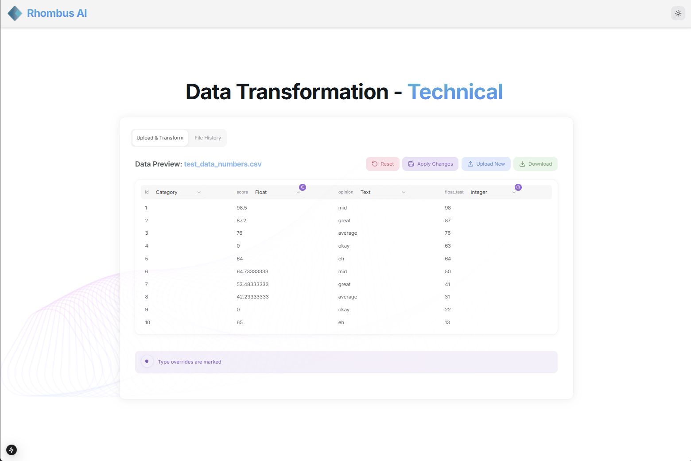
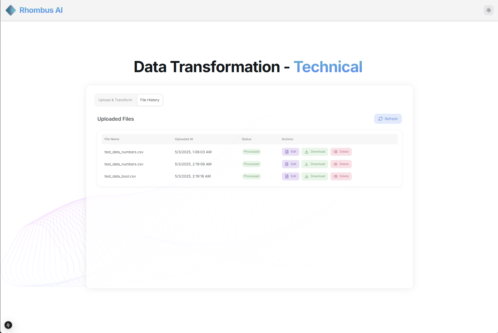
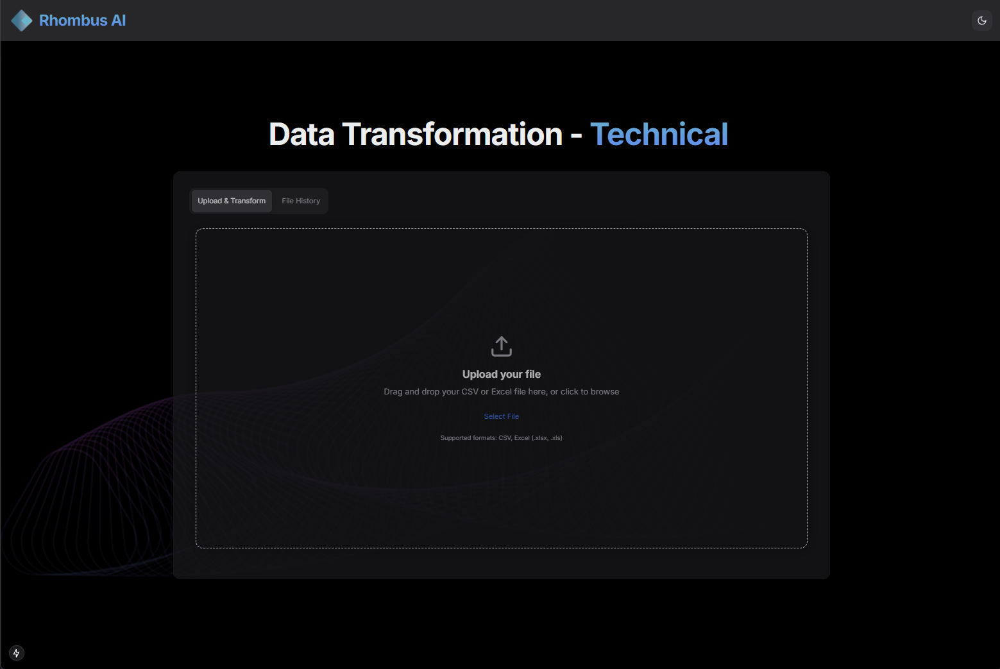

# RhombusAI Technical Assessment

This repository contains the backend and frontend for the RhombusAI Technical Project. The backend is built with Django and Django REST Framework, while the frontend is built with Next.js and HeroUI.

## Screenshots

### Data Preview View


### File History View


### Upload File View


## Table of Contents

- [Getting Started](#getting-started)
- [Backend Setup](#backend-setup)
  - [Installing Dependencies](#installing-dependencies)
  - [Running the Backend](#running-the-backend)
  - [Linting and Testing](#linting-and-testing)
- [Frontend Setup](#frontend-setup)
  - [Installing Dependencies](#installing-dependencies-1)
  - [Running the Frontend](#running-the-frontend)
  - [Linting](#linting)
- [Project Structure](#project-structure)

---

## Getting Started

To get started, clone the repository:

```bash
git clone git@github.com:kaisequeira/RhombusAITechnical.git
cd RhombusAITechnical
```

---

## Backend Setup

The backend is located in the `backend` directory and is built using Django.

### Installing Dependencies

1. Navigate to the backend directory:

   ```bash
   cd backend
   ```

2. Create a virtual environment:

   ```bash
   python3 -m venv .venv
   source .venv/bin/activate
   ```

3. Install the required dependencies:

   ```bash
   pip install -r requirements.txt
   ```

### Running the Backend

1. Apply database migrations:

   ```bash
   python3 manage.py migrate
   ```

2. Start the development server:

   ```bash
   python3 manage.py runserver
   ```

   The backend will be available at [http://localhost:8000](http://localhost:8000).

### Linting and Testing

1. To run tests for the backend, relating to the `utils.py` file:

   ```bash
   pytest backend/apiprocessor/tests
   ```

---

## Frontend Setup

The frontend is located in the `frontend` directory and is built using Next.js.

### Installing Dependencies

1. Navigate to the frontend directory:

   ```bash
   cd frontend
   ```

2. Install dependencies using `pnpm`:

   ```bash
   pnpm install
   ```

### Running the Frontend

1. Start the development server:

   ```bash
   pnpm run dev
   ```

   The frontend will be available at [http://localhost:3000](http://localhost:3000).

### Linting

1. To lint the frontend code, use the following command which will run both ESLint and Prettier:

   ```bash
   pnpm run lint
   ```

---

## Pre-Commit Hooks

Linting for the frontend (including Prettier and ESLint checks) as well as backend tests will run when committing. Please ensure that this is satisfied before pushing to master. You should avoid skipping the pre-commit hook when possible.

## Project Structure

```
RhombusAITechnical/
├── backend/
│   ├── apiprocessor/
│   │   ├── utils.py
│   │   ├── tests/
│   │   ├── test_utils.py
│   ├── requirements.txt
│   ├── manage.py
├── frontend/
│   ├── app/
│   ├── components/
│   ├── package.json
│   ├── pnpm-lock.yaml
│   ├── tailwind.config.js
├── README.md
├── docs/
```

---

## Notes

- The backend dependencies are listed in `TA/backend/requirements.txt`.
- The frontend dependencies are managed using `pnpm` and are listed in `TA/frontend/package.json`.
- Ensure you have Python 3.8+ and Node.js 18+ installed for compatibility.